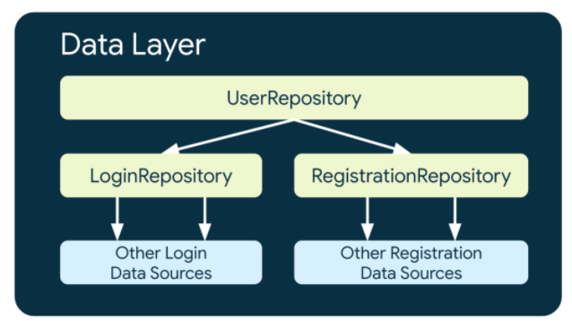

# 简述
通过[wanAndroid](https://www.wanandroid.com/blog/show/2)提供的API学习架构和kotlin语法

## 目录结构

```目录结构
.
├── app                                 # application根目录
│   ├── core                            # 共用模块代码
│   │    ├── utils                      # 工具类
│   │    ├── views                      # 自定义View
│   ├── data                            # 数据
│   │    ├── login                      # 登录模块
│   │    │    ├── model                 # pojo类
│   │    │    ├── datasource            # 数据源，是 App 中业务逻辑与系统 API 和三方 SDK 的桥接类。测试/内存/网络/数据库/文件等等。命名规范：数据类型 + 来源类型 + DataSource。
│   │    │    ├── LoginRepository       # 数据仓库类，使用 DataSource 处理业务逻辑，并将数据提供给上层调用者的类。命名规范：数据类型 + DataSource。
│   │    ├── xxx                        # 其他业务的数据模块
│   ├── ui                              # 界面
│   │    ├── login                      # 登录界面
│   │    │    ├── LoginViewModel        # 登录的view model，应该包含一个与之对应的UiState，使用LiveData
│   │    │    ├── LoginFragment         # 登录界面容器，有可能是Fragment或者Activity
│   │    ├── xxx                        # 其他业务的界面
├── extras                              # 工程相关的一些资料
└── README.md                           # 工程入口文档，务必细读
```

## 核心概念

### DataSource
每一个Data Source类应该只负责处理一个数据来源，这个数据来源可以是文件、网络、本地数据库。Data Source类是应用和数据操作的系统之间的桥梁。

应用体系结构中的其他层永远不应该直接访问Data Source，数据层的入口点应该总是Repository类。


### Repository
仓库类的职责：

- 向app剩余部分暴露数据 
- 集中更改数据 
- 解决多个数据源之间的冲突 
- 从程序的其它部分提取数据来源 
- 包含业务逻辑


每一个Repository都定义了一个单一真实来源，真是来源总是包含一致、正确、最新的数据。

数据层暴露的数据应该是不可变的(Immutable)，不会被其他类所篡改，该层也就不会陷入数据的不一致状态。而且不可变对象总是线程安全的。

数据层的类通常暴露执行Create、Read、Update和Delete的一次(one-shot)执行的函数和数据在一段时间内发生改变的通知。数据层应该暴露以下用例：

一次操作（one-shot operations）：如果使用Kotlin的话，数据层应暴露suspend方法；如果使用Java，应该暴露一个提供通知操作结果的回调的函数。
数据在一段时间内发生改变的通知：在Kotlin中，数据层应该暴露flows，在Java中，应该暴露一个可以发射（emit）新数据的回调。

```kotlin
class ExampleRepository(
    private val exampleRemoteDataSource: ExampleRemoteDataSource, // network
    private val exampleLocalDataSource: ExampleLocalDataSource // database
) {

    // 持续更新
    val data: Flow<Example> = ...
    // 一次操作
    suspend fun modifyData(example: Example) { ... }
}

```

#### 不要使用LiveData
https://zhuanlan.zhihu.com/p/491120010


### 多级Repositories
当业务需求更加复杂时，Repository可能会依赖其它的Repository，这可能是因为所需要的数据来自多个数据源的聚合，或者责任需要封装在另一个存储库中。

比如一个处理用户认证数据的Repository，UserRepository，可能需要依赖于LoginRepository和RegistrationRepository来实现需求。



### 线程
调用DataSource和Repository应该是主线程安全的，这些类有责任在处理长时间任务时将它们的逻辑移动到合适的线程。

注意很多数据源已经提供了主线程安全的APIs（比如suspend方法调用），如Room和Retrofit。你的Repository可以在这些API可用时利用这些优势。

### 生命周期
如果只是应用程序的特定部分需要重用这些类的实例，那么你就把这些实例的作用域设置成特定部分。举个例子，你可以将保存注册信息的RegistrationRepository绑定到RegistrationActivity。


### 暴露错误
与Repository和DataSource的交互可以成功，也可以在失败时抛出一个异常。UI层在调用数据层时处理异常。

数据层可以理解并处理不同种类的错误并通过自定义异常来暴露它们，比如UserNotAuthenticatedException。

> 注意，另一种模型是使用Result类。数据层返回一个Result<T>而不是T，这告诉其他层可能会有错误。
> 这在一些没有合适的异常处理的响应式编程API中是必要的，比如LiveData。


# 参考
## 架构参考
[Android官网-应用架构指南](https://developer.android.com/topic/architecture)
[Android 官方现代 App 架构解读](https://juejin.cn/post/7089826987279122463)
[一种清晰, 便于扩展android项目架构方案](https://juejin.cn/post/6962167993455345695)
[高质量App的架构设计与思考！](https://juejin.cn/post/6844904002640052237)
[重新学习Android —— （二）应用架构指南](https://www.cnblogs.com/lilpig/p/15754005.html)
[关于使用 Android MVVM + LiveData 模式的一些建议](https://zhuanlan.zhihu.com/p/33206893)
[Google 官方应用架构的最佳实践指南](https://ghrhome.gitbooks.io/data-beauty/content/google-guan-fang-ying-yong-jia-gou-de-zui-jia-shi-jian-zhi-nan.html)
[一点点入坑JetPack：实战前戏NetworkBoundResource篇](https://juejin.cn/post/6844903842149056526)

## kotlin参考
