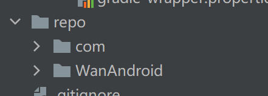
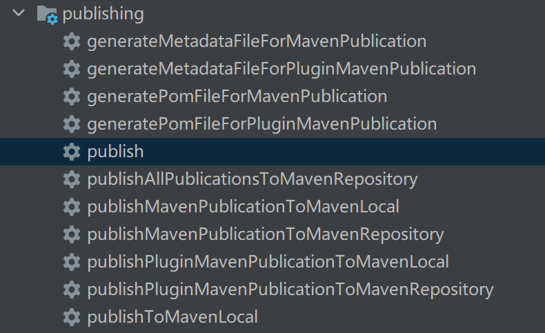

# 问题

## "Could not find com.android.tools.build:gradle:7.2.0
我现在修改成依赖4.0.2版本了。
猜测原因应该是我们本地是java1.7，应该需要依赖java11

## Build was configured to prefer settings repositories over project repositories but repository 'Gradle Libs' was added by unknown code

需要修改 setting.gradle，删除 repositoriesMode.set(RepositoriesMode.FAIL_ON_PROJECT_REPOS)

```groovy
dependencyResolutionManagement {
//    repositoriesMode.set(RepositoriesMode.FAIL_ON_PROJECT_REPOS)
    repositories {
        google()
        mavenCentral()
    }
}
```


## publish之后，出现了两个库

如下图所示


竟然出现了两个库！！！我们再看下右侧的gradle的task


可以看到除了咱们自定义的maven任务，还多了一个pluginMaven名字相关的task，到底是哪里引入了呢？
在custom-gradle-plugin下的build.gradle里面
```groovy
plugins {
    id 'java-library'
    id 'org.jetbrains.kotlin.jvm'
    id 'java-gradle-plugin'
}
```
我们引入了一个 java-gradle-plugin的插件，这个的作用类似于maven-publish，相当于我们依赖了两个publish插件，
这里我们直接去掉java-gradle-plugin就可以了