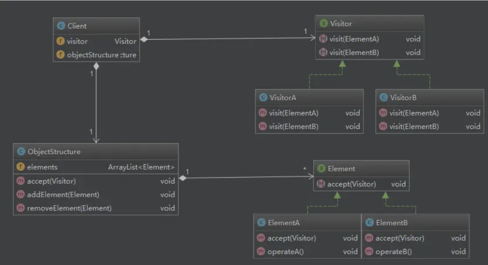
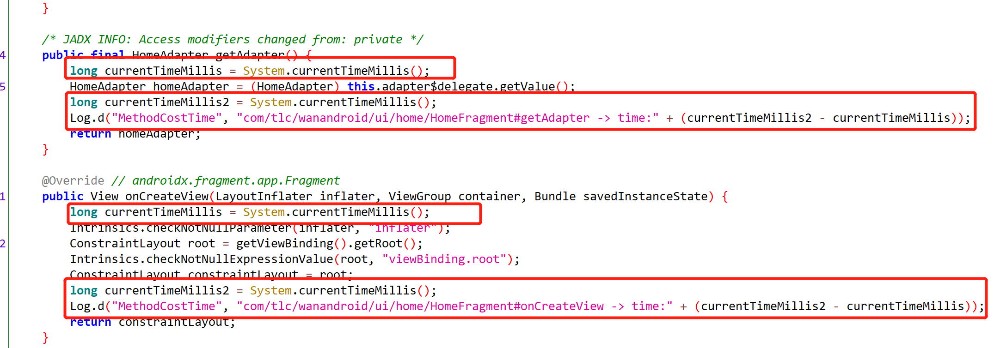

# 自定义plugin
参考：https://blog.csdn.net/guiying712/article/details/104702731
https://www.jianshu.com/p/3ec8e9574aaf

## 新建一个CustomPlugin
```kotlin
import org.gradle.api.Plugin
import org.gradle.api.Project

class CustomPlugin: Plugin<Project> {

    override fun apply(project: Project) {
        println()
        println("########################################################################")
        println("##########                                                    ##########")
        println("##########                Custom Plugin                       ##########")
        println("##########                                                    ##########")
        println("########################################################################")
        println()
    }
}
```

## 创建resources
- 在main目录下，与java同级目录，创建resources目录
- 在resources目录下，创建META-INF目录
- 在META-INF目录下，创建gradle-plugins目录

## 创建properties
在gradle-plugins目录下，创建一个自定义的 xxx.properties

这个xxx，就是插件的名字，后续使用就需要：
```groovy
apply 'xxx'
```

咱们这里创建的名字为com.baic.icc.gradle.plugin.customPlugin.properties

## properties增加内容

```properties
implementation-class=xxx
```
这个xxx是我们自定义插件的全限定名，就是咱们实现了Plugin<Project>接口的类的全限定名

咱们这里的路径是
```properties
implementation-class=com.baic.icc.gradle.plugin.CustomPlugin
```

## 发布jar包
点击右侧gradle任务列表的publish即可

## 修改工程目录的setting.gradle
```groovy
pluginManagement {
    repositories {
        maven { url './repo' }
        gradlePluginPortal()
        google()
        mavenCentral()
    }
}
dependencyResolutionManagement {
//    repositoriesMode.set(RepositoriesMode.FAIL_ON_PROJECT_REPOS)
    repositories {
        maven { url './repo' }
        google()
        mavenCentral()
    }
}
```

增加`maven { url './repo' }`

## 修改工程目录的build.gradle
```groovy
buildscript {
    dependencies {
        /**
         * 自定义gradle插件依赖
         */
        classpath "com.baic.icc.gradle.plugin:test-asm:1.0.0"
    }
}
```
这个classpath是刚才发布的jar包

## 修改app目录的build.gradle（也就是使用这个插件的module）
```groovy
plugins {
    id 'com.android.application'
    id 'org.jetbrains.kotlin.android'
    id 'com.baic.icc.gradle.plugin.customPlugin'
}
```
增加 `id 'com.baic.icc.gradle.plugin.customPlugin'`
这个id，就是前面创建的properties的文件名

## 测试

到此已经配置完成了，我们同步一下gradle，可以在Build里面看到我们的打印：


# 自定义Transform
参考；https://juejin.cn/post/7098752199575994405
http://quinnchen.cn/2018/09/13/2018-09-13-asm-transform/


Transform API 是 Android Gradle Plugin 1.5 就引入的特性，主要用于在 Android 构建过程中， 在 Class→Dex 这个节点修改 Class 字节码。
利用 Transform API，我们可以拿到所有参与构建的 Class 文件，借助 Javassist 或 ASM 等字节码编辑工具进行修改，插入自定义逻辑。
一般来说，这些自定义逻辑是与业务逻辑无关的。

使用 Transform 的常见的应用场景有：

- 埋点统计： 在页面展现和退出等生命周期中插入埋点统计代码，以统计页面展现数据；
- 耗时监控： 在指定方法的前后插入耗时计算，以观察方法执行时间；
- 方法替换： 将方法调用替换为调用另一个方法。


## BaseCustomTransform
Transform 的核心代码在 transform() 方法中，我们要做的就是遍历输入文件，再把修改后的文件复制到目标路径中，对于 JarInputs 还有一次解压和压缩。更进一步，再考虑增量编译的情况。
因此，整个 Transform 的核心过程是有固定套路，模板流程图如下：


我们把整个流程图做成一个抽象模板类，子类需要重写 provideFunction() 方法，从输入流读取 Class 文件，修改完字节码后再写入到输出流。
甚至不需要考虑 Transform 的输入文件遍历、加解压、增量等。

## 测试
运行App程序，可以在Build里面看到咱们自定义Transform代码里面的打印：


咱们看这个任务名字，`:app:transformClassesWithCustomTransformForDebug`，跟咱们在CustomTransform里面设置的名字一样，规则也是一致的：
```
transform[InputTypes]With[name]For[Configuration]
```

InputTypes也对应的是getInputTypes()里面的设置，一般来说就是两个：
- CLASSES
- RESOURCES

# ASM

## 访问者模式
[访问者模式一篇就够了](https://www.jianshu.com/p/1f1049d0a0f4)


## 使用
[Android - ASM 插桩你所需要知道的基础](https://juejin.cn/post/7000572440988352549)
[ASM框架学习(二)-ClassVisitor](https://www.jianshu.com/p/dcc9ffcf9c8e)
[ASM框架学习(三)-FieldVisitor和MethodVisitor](https://www.jianshu.com/p/d8c2ada6e82f)

### ClassVisitor

ClassVisitor有很多visit方法，这些方法的执行顺序是什么样子的：
```
visit
[visitSource][visitModule][visitNestHost][visitPermittedSubclass][visitOuterClass]
(
 visitAnnotation |
 visitTypeAnnotation |
 visitAttribute
)*
(
 visitNestMember |
 visitInnerClass |
 visitRecordComponent |
 visitField |
 visitMethod
)* 
visitEnd
```
说明：
- visit，visitEnd必须调用一次
- []表示最多调用一次，也就是0次或者1次
- ()*表示()里面的访问可以按照排列顺序调用多次，也就是0次或者多次。

可以简化一下：
```
visit
(
 visitField |
 visitMethod
)* 
visitEnd
```


### ClassWriter

```kotlin
val classWriter = ClassWriter(ClassWriter.COMPUTE_MAXS)
```
我们一般这样使用，参数的意义：

- `0`：
ASM不会自动计算max stacks和max locals，也不会自动计算stack map frames。

- `ClassWriter.COMPUTE_MAXS`：
ASM会自动计算max stacks和max locals，但不会自动计算stack map frames。

- `ClassWriter.COMPUTE_FRAMES`（**推荐使用**）：
ASM会自动计算max stacks和max locals，也会自动计算stack map frames。

推荐使用的原因是我们修改了字节码后，局部变量表或操作数栈可能也需要做相应的改变，手动计算的逻辑容易出错，不如直接交给 ASM，当然编译的效率会有一定的下降


### MethodVisitor
```
[
    visitCode
    (
        visitFrame |
        visitXxxInsn |
        visitLabel |
        visitTryCatchBlock
    )*
    visitMaxs
]
visitEnd
```
- visitCode()方法，调用一次，标志着方法体（method body）的开始。
- visitXxxInsn()方法，对应方法体（method body）本身,可以调用多次，是对字节码指令的访问（参数，方法调用等）。
- visitMaxs()方法，调用一次,标志着方法体（method body）的结束，包括 return 指令。
- visitEnd()方法，调用一次，方法结束时调用
- 其中visitXxxInsn 在修改方法内容的时候很有用，它可以遍历字节码中调用的指令。


#### access
表示方法的修饰符，修饰符在 ASM 中是以 “ACC_” 开头的常量进行定义。
- ACC_PUBLIC（public）
- ACC_PRIVATE（private）
- ACC_PROTECTED（protected）
- ACC_STATIC（static）
- ACC_FINAL（final）
- ACC_SYNCHRONIZED（同步的）
- ACC_VARARGS（不定参数个数的方法）
- ACC_NATIVE（native类型方法）
- ACC_ABSTRACT（抽象的）
- ACC_DEPRECATED（标记了@Deprecated注解的方法）
- ACC_STRICT
- ACC_SYNTHETIC，内部生成的方法，一些桥方法


### Opcodes
[ASM Opcodes](https://juejin.cn/post/6998397307913781256)


### 注解
[教你如何完全解析Kotlin中的注解](https://juejin.cn/post/6844903829868134407)

#### 元注解
- @Target
```kotlin
public enum class AnnotationTarget {
    CLASS, //表示作用对象有类、接口、object对象表达式、注解类
    ANNOTATION_CLASS,//表示作用对象只有注解类
    TYPE_PARAMETER,//表示作用对象是泛型类型参数(暂时还不支持)
    PROPERTY,//表示作用对象是属性
    FIELD,//表示作用对象是字段，包括属性的幕后字段
    LOCAL_VARIABLE,//表示作用对象是局部变量
    VALUE_PARAMETER,//表示作用对象是函数或构造函数的参数
    CONSTRUCTOR,//表示作用对象是构造函数，主构造函数或次构造函数
    FUNCTION,//表示作用对象是函数，不包括构造函数
    PROPERTY_GETTER,//表示作用对象是属性的getter函数
    PROPERTY_SETTER,//表示作用对象是属性的setter函数
    TYPE,//表示作用对象是一个类型，比如类、接口、枚举
    EXPRESSION,//表示作用对象是一个表达式
    FILE,//表示作用对象是一个File

    @SinceKotlin("1.1")
    TYPEALIAS //表示作用对象是一个类型别名
}
```
- @Retention
```kotlin
public enum class AnnotationRetention {
    SOURCE,//源代码时期(SOURCE): 注解不会存储在输出class字节码中
    BINARY,//编译时期(BINARY): 注解会存储出class字节码中，但是对反射不可见
    RUNTIME//运行时期(RUNTIME): 注解会存储出class字节码中，也会对反射可见, 默认是RUNTIME
}
```
- xxx

## 实例

### 替换父类


### 根据注解进行一些操作
目的：对注解标识的类的每一个方法，计算耗时
参考custom-gradle-plugin里面的annotation包下代码

- 定义一个注解TestAsm
- 需要计算耗时的类上增加这个注解
- 在ClassVisitor#visitAnnotation里面得到注解
  - 如果不是estAsm，就不处理
  - 如果是estAsm，就继续在visitMethod里面过滤掉native、Synthetic等方法
- 在AdviceAdapter的onMethodEnter和onMethodExit分别插入代码即可

最后效果如下图：


## Android Studio 插件

### ASM Bytecode Viewer
- 搜索安装“ASM Bytecode Viewer”
- 对应的类上点击右键，点击"ASM Bytecode Viewer"
- 或者，打开对应的类，点击右侧的ASMPlugin

### ASM Bytecode Viewer Support Kotlin
- 搜索安装“ASM Bytecode Viewer Support Kotlin”
- 打开对应的类
- 然后点击 顶部导航栏-Code-ASM Bytecode Viewer

### 使用

1、建一个空的类，增加如需要插入的代码
```kotlin
fun test() {
    var startTime = System.currentTimeMillis()
    var endTime = System.currentTimeMillis()
    var sb = StringBuilder()
    sb.append("com/tlc/asm/wanandroid.MainActivity#onCreate time: ");
    sb.append(endTime - startTime)
    Log.d("MethodCostTime", sb.toString());
}
```
2、通过工具得到大概的ASM代码
3、工具生成的ASM代码进行二次处理，达到符合目的

## 注意
> 1、当我们使用 ASM 处理字节码时，需要 逐步小量的修改、验证，切记不要编写大量的字节码并希望它们能够立即通过验证并且可以马上执行。
> 比较稳妥的做法是，每编写一行字节码时就考虑一下操作数栈与局部变量表之间的变化情况，确定无误之后再写下一行。
> 此外，除了 JVM 的验证器之外，ASM 还维护了一个单独的字节码验证器，它也会检查你的字节码实现是否符合 JVM 规范。
2、注意本地变量表和操作数栈的数据交换以及 try catch blcok 的处理，关于异常处理可以使用 ASM 提供的 CheckClassAdapter，
> 可以在修改完成后验证一下字节码是否正常。


# 问题

## "Could not find com.android.tools.build:gradle:7.2.0
我现在修改成依赖4.0.2版本了。
猜测原因应该是我们本地是java1.7，应该需要依赖java11

## Build was configured to prefer settings repositories over project repositories but repository 'Gradle Libs' was added by unknown code

需要修改 setting.gradle，删除 repositoriesMode.set(RepositoriesMode.FAIL_ON_PROJECT_REPOS)

```groovy
dependencyResolutionManagement {
//    repositoriesMode.set(RepositoriesMode.FAIL_ON_PROJECT_REPOS)
    repositories {
        google()
        mavenCentral()
    }
}
```

## publish之后，出现了两个库

如下图所示


竟然出现了两个库！！！我们再看下右侧的gradle的task


可以看到除了咱们自定义的maven任务，还多了一个pluginMaven名字相关的task，到底是哪里引入了呢？
在custom-gradle-plugin下的build.gradle里面
```groovy
plugins {
    id 'java-library'
    id 'org.jetbrains.kotlin.jvm'
    id 'java-gradle-plugin'
}
```
我们引入了一个 java-gradle-plugin的插件，这个的作用类似于maven-publish，相当于我们依赖了两个publish插件，
这里我们直接去掉java-gradle-plugin就可以了