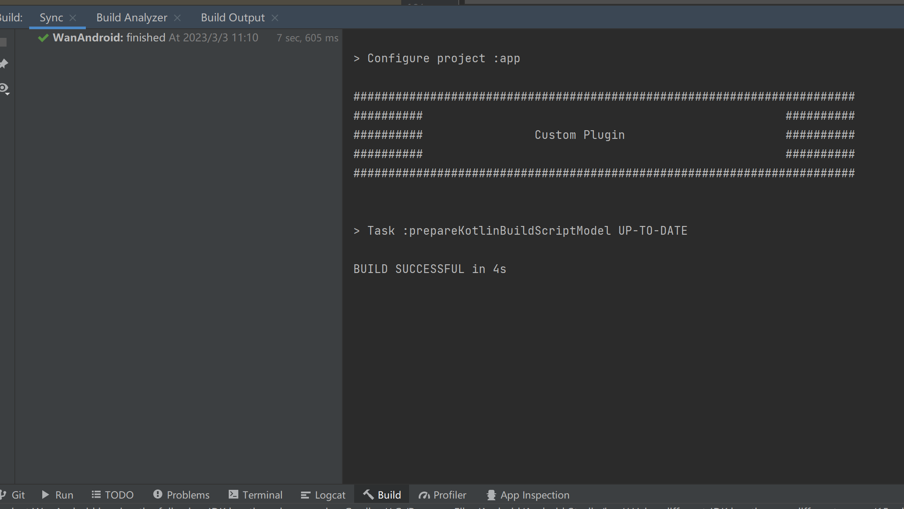
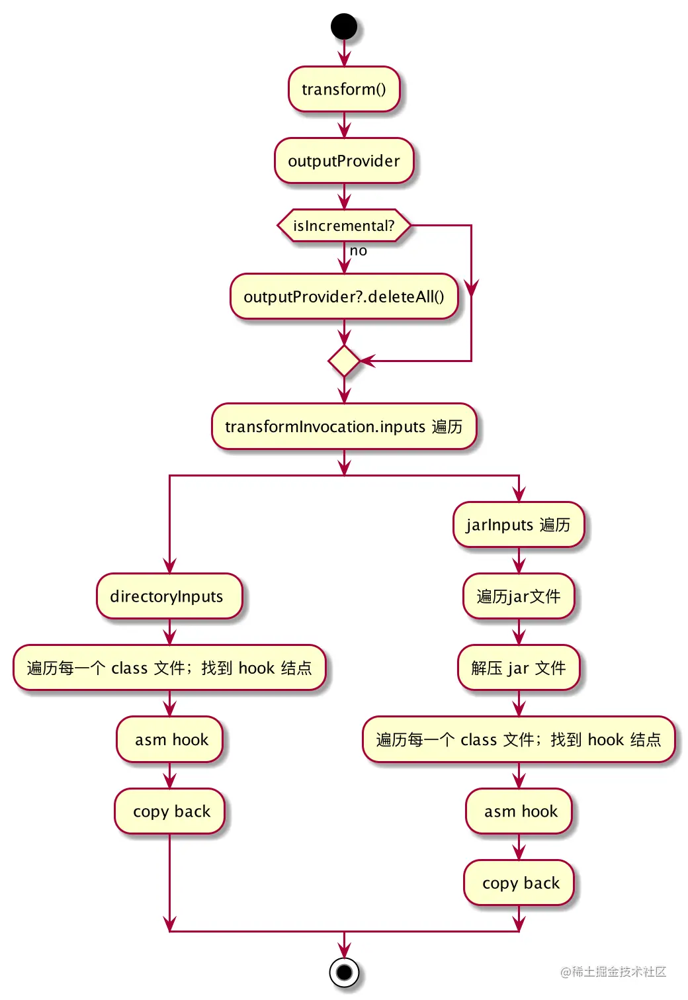
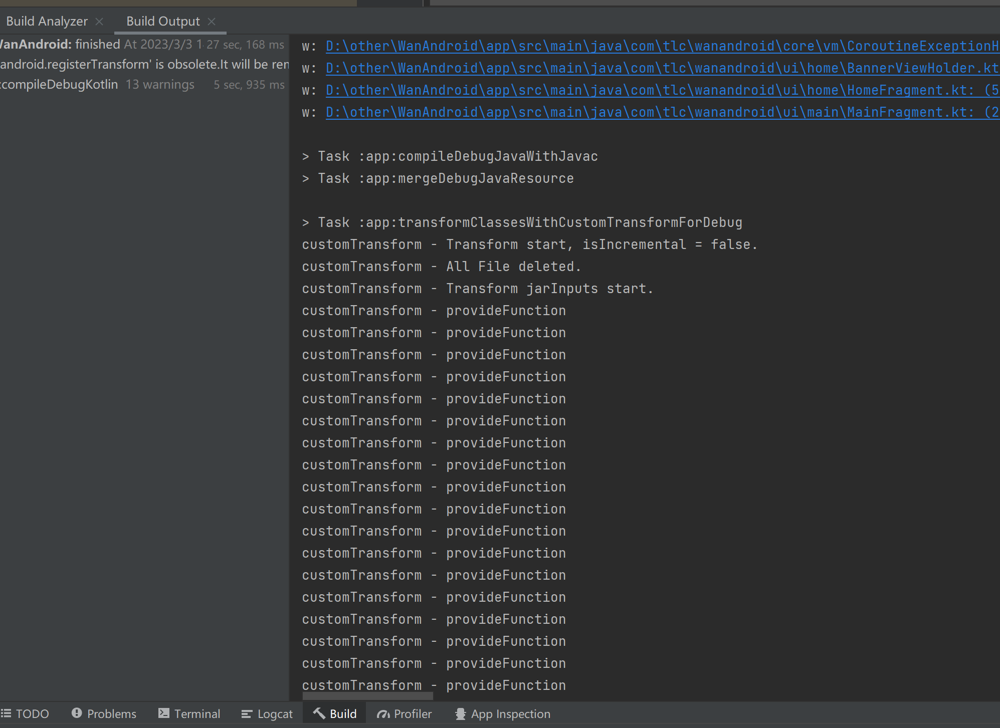

# 自定义plugin
参考：https://blog.csdn.net/guiying712/article/details/104702731
https://www.jianshu.com/p/3ec8e9574aaf

## 新建一个CustomPlugin
```kotlin
import org.gradle.api.Plugin
import org.gradle.api.Project

class CustomPlugin: Plugin<Project> {

    override fun apply(project: Project) {
        println()
        println("########################################################################")
        println("##########                                                    ##########")
        println("##########                Custom Plugin                       ##########")
        println("##########                                                    ##########")
        println("########################################################################")
        println()
    }
}
```

## 创建resources
- 在main目录下，与java同级目录，创建resources目录
- 在resources目录下，创建META-INF目录
- 在META-INF目录下，创建gradle-plugins目录

## 创建properties
在gradle-plugins目录下，创建一个自定义的 xxx.properties

这个xxx，就是插件的名字，后续使用就需要：
```groovy
apply 'xxx'
```

咱们这里创建的名字为com.baic.icc.gradle.plugin.customPlugin.properties

## properties增加内容

```properties
implementation-class=xxx
```
这个xxx是我们自定义插件的全限定名，就是咱们实现了Plugin<Project>接口的类的全限定名

咱们这里的路径是
```properties
implementation-class=com.baic.icc.gradle.plugin.CustomPlugin
```

## 发布jar包
点击右侧gradle任务列表的publish即可

## 修改工程目录的setting.gradle
```groovy
pluginManagement {
    repositories {
        maven { url './repo' }
        gradlePluginPortal()
        google()
        mavenCentral()
    }
}
dependencyResolutionManagement {
//    repositoriesMode.set(RepositoriesMode.FAIL_ON_PROJECT_REPOS)
    repositories {
        maven { url './repo' }
        google()
        mavenCentral()
    }
}
```

增加`maven { url './repo' }`

## 修改工程目录的build.gradle
```groovy
buildscript {
    dependencies {
        /**
         * 自定义gradle插件依赖
         */
        classpath "com.baic.icc.gradle.plugin:test-asm:1.0.0"
    }
}
```
这个classpath是刚才发布的jar包

## 修改app目录的build.gradle（也就是使用这个插件的module）
```groovy
plugins {
    id 'com.android.application'
    id 'org.jetbrains.kotlin.android'
    id 'com.baic.icc.gradle.plugin.customPlugin'
}
```
增加 `id 'com.baic.icc.gradle.plugin.customPlugin'`
这个id，就是前面创建的properties的文件名

## 测试

到此已经配置完成了，我们同步一下gradle，可以在Build里面看到我们的打印：



# 自定义Transform
参考；https://juejin.cn/post/7098752199575994405


Transform API 是 Android Gradle Plugin 1.5 就引入的特性，主要用于在 Android 构建过程中， 在 Class→Dex 这个节点修改 Class 字节码。
利用 Transform API，我们可以拿到所有参与构建的 Class 文件，借助 Javassist 或 ASM 等字节码编辑工具进行修改，插入自定义逻辑。
一般来说，这些自定义逻辑是与业务逻辑无关的。

使用 Transform 的常见的应用场景有：

- 埋点统计： 在页面展现和退出等生命周期中插入埋点统计代码，以统计页面展现数据；
- 耗时监控： 在指定方法的前后插入耗时计算，以观察方法执行时间；
- 方法替换： 将方法调用替换为调用另一个方法。


## BaseCustomTransform
Transform 的核心代码在 transform() 方法中，我们要做的就是遍历输入文件，再把修改后的文件复制到目标路径中，对于 JarInputs 还有一次解压和压缩。更进一步，再考虑增量编译的情况。
因此，整个 Transform 的核心过程是有固定套路，模板流程图如下：



我们把整个流程图做成一个抽象模板类，子类需要重写 provideFunction() 方法，从输入流读取 Class 文件，修改完字节码后再写入到输出流。
甚至不需要考虑 Transform 的输入文件遍历、加解压、增量等。

## 测试
运行App程序，可以在Build里面看到咱们自定义Transform代码里面的打印：



咱们看这个任务名字，`:app:transformClassesWithCustomTransformForDebug`，跟咱们在CustomTransform里面设置的名字一样，规则也是一致的：
```
transform[InputTypes]With[name]For[Configuration]
```

InputTypes也对应的是getInputTypes()里面的设置，一般来说就是两个：
- CLASSES
- RESOURCES

# ASM


# 问题

## "Could not find com.android.tools.build:gradle:7.2.0
我现在修改成依赖4.0.2版本了。
猜测原因应该是我们本地是java1.7，应该需要依赖java11

## Build was configured to prefer settings repositories over project repositories but repository 'Gradle Libs' was added by unknown code

需要修改 setting.gradle，删除 repositoriesMode.set(RepositoriesMode.FAIL_ON_PROJECT_REPOS)

```groovy
dependencyResolutionManagement {
//    repositoriesMode.set(RepositoriesMode.FAIL_ON_PROJECT_REPOS)
    repositories {
        google()
        mavenCentral()
    }
}
```

## publish之后，出现了两个库

如下图所示


竟然出现了两个库！！！我们再看下右侧的gradle的task


可以看到除了咱们自定义的maven任务，还多了一个pluginMaven名字相关的task，到底是哪里引入了呢？
在custom-gradle-plugin下的build.gradle里面
```groovy
plugins {
    id 'java-library'
    id 'org.jetbrains.kotlin.jvm'
    id 'java-gradle-plugin'
}
```
我们引入了一个 java-gradle-plugin的插件，这个的作用类似于maven-publish，相当于我们依赖了两个publish插件，
这里我们直接去掉java-gradle-plugin就可以了